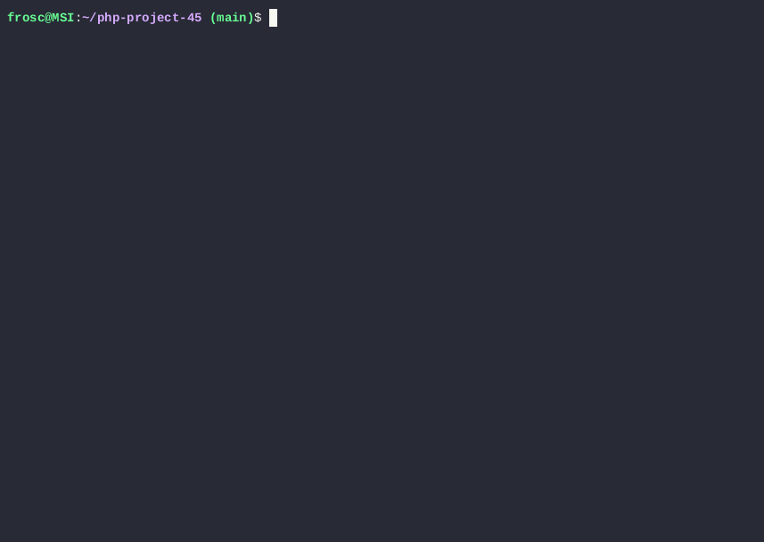

# Brain games

[](https://github.com/froscrain/php-project-45/actions)
[](https://sonarcloud.io/summary/new_code?id=froscrain_php-project-45)
[](https://sonarcloud.io/summary/new_code?id=froscrain_php-project-45)
[](https://sonarcloud.io/summary/new_code?id=froscrain_php-project-45)
[](https://sonarcloud.io/summary/new_code?id=froscrain_php-project-45)

This package includes a set of five CLI games based on popular mobile apps for brain training.

## Requirements

* PHP >= 8.3
* Composer

## Setup

```bash
git clone git@github.com:froscrain/php-project-45.git
cd php-project-45
make install
```

## Usage

```bash
make brain-even
make brain-calc
make brain-gcd
make brain-progression
make brain-prime
```

## Gameplay

* brain-even



* brain-calc


* brain-gcd


* brain-progression


* brain-prime


